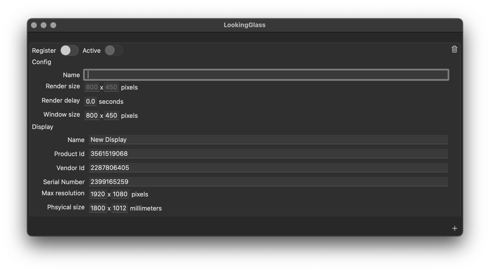
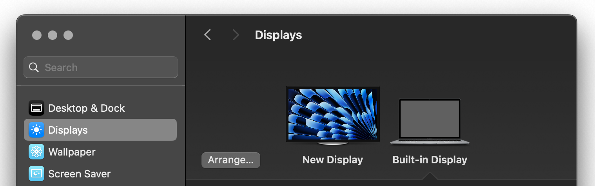
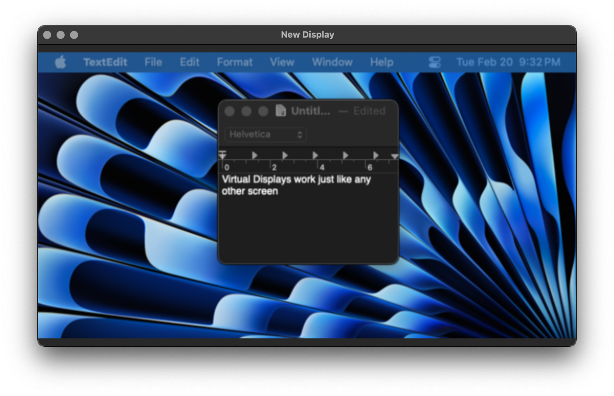
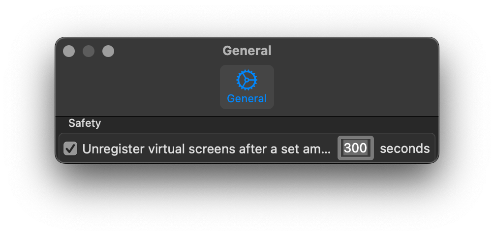

# LookingGlass

    

Virtual Display Manager for MacOS

# Documentation

LookingGlass lets you create virtual displays/screens/monitor recognized by MacOS like any other. They work just like a regular display, you can set wallpapers, drag apps onto them etc.

## Settings

**Unregister automatically**: in case things go wrong, for example if you set a virtual display as your Main Display, this serves as a safety net by automatically removing the display after a while. This setting exists because it happened to me during development.

## Configuration

**Register**: registers the display with the system, will cause the display to show under system settings.
**Active**: opens a window showing the display's view.

**Window size**: the size of the window in which the virtual display is shown.
**Render size**: the size of the image showing the virtual screen. This is stretched to fit the window size. It can be useful to lower this for performance reasons.
**Render delay**: normally the virtual display window is updated as fast as possible. You can throttle the refresh rate for performance reasons.

## Display Configuration
This is the information passed to the system to describe the display.

**Product** / **Vendor** / **Serial Number**: these are randomized for convenience but can be changed. The system uses this to identify the display and remember its settings.
**Max resolution**: no obvious use.
**Physical size**: no obvious use.
**Display modes**: the resolution and refresh rate the system will show as available and use for the screen.

# Misc

Useful commands:

Clear app settings:
`defaults delete pgim.LookingGlass.plist glassConfigs`

Clear OS settings for current and previously connected displays:
`defaults delete com.apple.windowserver.plist DisplayAnyUserSets`

# References
* https://github.com/KhaosT/CGVirtualDisplay

